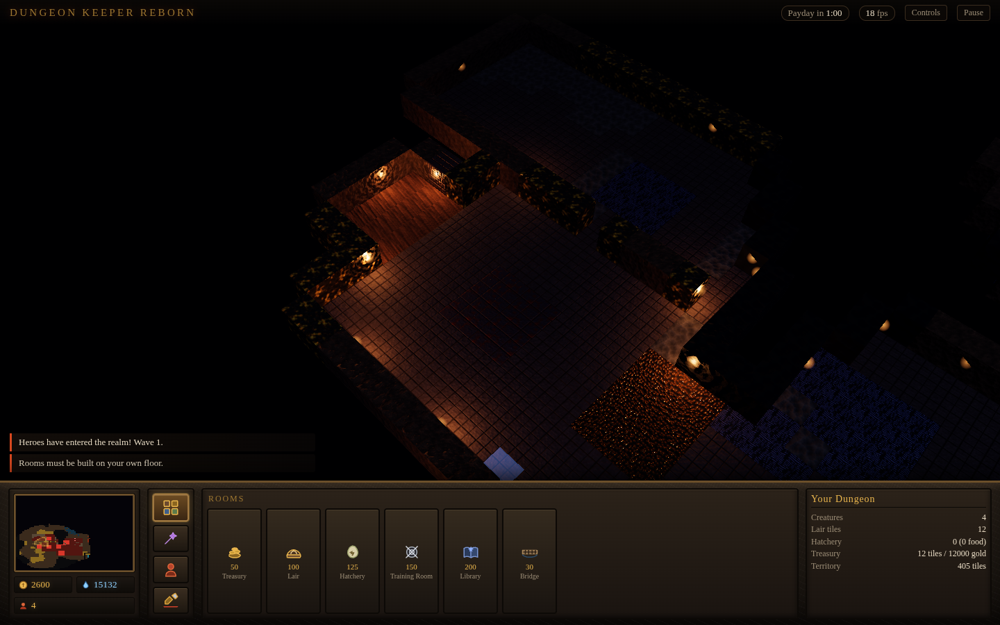

# Dungeon Keeper Reborn

A clean-room reimagining of the 1997 dungeon-management classic: you are an evil
keeper, you carve a dungeon out of solid rock, you lure monsters into it, and
you feed the heroes who come to stop you to those monsters.

The goal is the original's **look and feel**, rebuilt with modern rendering —
torchlit PBR materials, dynamic lights, real-time shadows, bloom — and made to
run on anything with a browser.



## Play it

**Web (all platforms, nothing to install):** play it at
**<https://joko1977-ui.github.io/DungeonKeeperReborn/>**, or run it locally in
two commands. It works on Windows, macOS, Linux, Android and iOS —
anything with a modern browser. On desktop Chrome/Edge and on Android you can
also use *Install app* to get it as a standalone, offline-capable PWA.

```bash
npm install
npm run dev          # http://localhost:5173
```

For a production build:

```bash
npm run build        # outputs to dist/
npm run preview      # serve the built game on :4173
```

`dist/` is a fully static directory — drop it on any web host, or open it from a
file server. There is no backend.

**Desktop (native window):** a [Tauri](https://tauri.app) shell wraps the same
build into a real application for Windows, macOS and Linux. It is deliberately
thin — a native window around the web build — so there is only ever one game to
maintain.

```bash
npm install
npm run tauri build  # bundles .msi/.exe, .dmg, .deb and .AppImage
```

Icons under `src-tauri/icons/` are generated from a single source with
`npm run tauri icon <file.png>`; they are committed because the Rust build
embeds them at compile time.

CI builds all three desktop platforms and the web bundle on every push, and
deploys the web build to GitHub Pages from the default branch; see
`.github/workflows/build.yml`.

Pages needs switching on **once, by hand**: **Settings → Pages → Source →
GitHub Actions**. The workflow token is permitted to publish to an existing
Pages site but not to create one, so this cannot be automated from CI; the
deploy job checks for it and fails with that instruction if it is missing.

## Controls

The original's mouse language is unusual, and it *is* the interface, so it is
reproduced exactly.

| Input | Action |
| --- | --- |
| **Left click / drag** | Tag walls for excavation. The first tile decides whether the drag tags or untags. |
| **Left click** on your creature | Snatch it into the Hand of Evil. Click again to drop it on any floor you own. |
| **Right click** on a creature | Slap it — it works faster, takes a little damage, and resents you. |
| **Right click** on a wall | Clear an excavation tag. |
| **Middle drag**, **Q** / **E** | Rotate the view. |
| **Wheel**, **PgUp/PgDn** | Zoom. |
| **WASD** / arrows / screen edge | Move the view. |
| **R** / **F** / **C** | Rooms, Spells and Creatures tabs. **1–9** picks from the open tab. |
| **Space** | Pause. **Esc** puts down the selected tool. |
| **Top right** | Toggle the sound mix and the narrator. |

### On a tablet or phone

One finger is the Hand of Evil, two fingers are the camera. Tagging a slab of
wall is a drag and it is the thing you do most, so it gets the single finger;
the camera lives on the two-finger gesture, which had to carry a pinch anyway.

| Gesture | Action |
| --- | --- |
| **Tap** | Tag a wall (tap again to untag) · pick up one of your creatures · drop what you are holding |
| **One-finger drag** | Paint tags across a slab, exactly as holding the left button does |
| **Press and hold** | Slap the creature under your finger |
| **Two-finger drag** | Move the view |
| **Pinch / twist** | Zoom and rotate |

The moment a second finger lands, anything the first one had started is
abandoned — a two-finger pan never leaves a trail of tagged walls behind it.

Add it to your home screen for a full-screen, offline-capable app. Rendering
quality is chosen from the device and steps down on its own if the frame rate
cannot keep up; `?quality=high` or `?quality=low` overrides that if you want to
see what the hardware will really do.

## How the game works

Play follows the original's loop:

1. **Tag and dig.** Your imps excavate anything you have tagged and can reach,
   working inward through a tagged slab layer by layer.
2. **Claim.** Dug floor is neutral until an imp converts it. Claimed floor is
   the only place you can build, and it is what generates mana and lights the
   corridors.
3. **Mine.** Gold seams pay into your treasury — but only as much as your
   treasury has room for, so treasure rooms are a real constraint. Gem seams
   never run out.
4. **Build.** A lair and a hatchery are the gate on everything else: creatures
   will not come through your portal without a bed to sleep in and food to eat.
5. **Keep them.** Creatures get hungry, tired and angry. Unpaid creatures at
   payday become furious; furious creatures walk out through your portal.
6. **Fight.** Heroes arrive in escalating waves from the hero gate. Lose your
   Dungeon Heart and the level is over.

Rooms available: Treasury, Lair, Hatchery, Training Room, Library and Bridge.
Keeper spells: Create Imp, Heal, Speed, Lightning, Call to Arms and Possess.

## Sound

All of it is synthesised in the browser. No audio files ship with the game, for
the same reasons no images do.

**Ambience** is a continuous bed: a low detuned drone through a slowly breathing
filter, cave rumble from brown noise, torch crackle, and water drips fed mostly
into a reverb built from a synthetic impulse response, so they land as
*somewhere down the corridor* rather than next to your ear.

**Score** is a slow four-chord progression in a natural minor, played on long
overlapping pads that never quite resolve. Underneath it is the Dungeon Heart —
a two-thump pulse that **quickens as hostile creatures get closer to your
heart**. It is the cheapest warning system in the game and you feel it before
you read anything.

**Effects** are one-shots built from oscillators and shaped noise, panned and
attenuated by where they happened relative to the camera; anything past the
camera's reach is dropped entirely. Because a dozen imps generate dig events
several times a second each, every sound has a minimum spacing and the mix has a
per-frame voice cap — otherwise a working dungeon is just noise. A limiter on
the master bus keeps a busy fight from clipping.

### About the narrator

The original's voice is a performance by a specific actor. That is not something
this project can or should reproduce, and no attempt is made to imitate it.

What *is* reproduced is the role it played: a dry, faintly contemptuous presence
that comments on your dungeon and is never quite on your side. Delivery goes
through your platform's own speech synthesiser — pitched well down and slowed,
preferring a deep English voice where the system has one. The writing is
original.

So he will not sound like the narrator you remember. He is, however, no fonder
of you:

> *"Payday. Your creatures are briefly tolerable."*
> *"Heroes. They have come to be reasonable at you. Kill them."*
> *"Your heart is broken. Somewhere a knight is being given a medal."*

Narration is event-driven: game notifications carry a typed cue, and the
narrator maps cues to lines with per-cue cooldowns and several variants each, so
a long game does not become one sentence on a loop. Low-priority remarks are
dropped rather than queued while something important is being said, and the
ambience ducks under the voice.

Everything degrades quietly. No Web Audio, no speech synthesis, no voices
installed, or a player who has simply turned it off — the game runs silent and
the printed message log carries on doing its job. Audio only starts on a real
click, because browsers refuse otherwise.

## How it is built

```
src/
  core/        the simulation — no rendering, no DOM
    constants.ts   terrain, rooms, spells, balance numbers
    tilemap.ts     the grid, as parallel typed arrays
    pathfinding.ts A* plus a "nearest thing matching X" search
    creatures.ts   the roster and the creature record
    ai.ts          needs-driven creature behaviour
    rooms.ts       placement, selling, room lookup index
    game.ts        the tick, the economy, spells, the Hand of Evil
    levelgen.ts    seeded realm generation
  render/      three.js
    textures.ts        every material, generated procedurally at load
    terrain.ts         the whole dungeon in two instanced draw calls
    creatureModels.ts  creature meshes built from primitives (25-40 parts each)
    creatureRenderer.ts instanced drawing and procedural animation
    roomProps.ts       room furniture — heaps, nests, dummies, the Heart
    effects.ts         torches, dynamic lights, particles
    scene.ts           renderer, lighting rig, post-processing
  audio/       the soundscape, all synthesised
    synth.ts       noise buffers, cave impulse response, envelopes
    audio.ts       buses, ambience, score, positional one-shots
    narrator.ts    speech synthesis, line pools, cue cooldowns
    director.ts    game events -> sound, with rate limiting
  input/       camera control and the Hand of Evil
  ui/          the keeper's panel, minimap, icons, overlays
```

A few decisions worth knowing about:

- **The simulation is separate from everything else.** `src/core` has no
  reference to three.js or the DOM. It runs headlessly, which is how the game
  loop was tested before there was anything to look at.
- **Fixed 20 Hz simulation, free-running render.** Behaviour is identical at 30
  or 144 fps; only smoothness changes.
- **No art assets ship with the game.** Every texture is generated from noise
  functions at load time and every creature is built from primitives. That keeps
  the download small, keeps materials sharp at any resolution, and means nothing
  in the repository is anyone else's artwork.
- **Two draw calls for the entire map.** Floors and walls are instanced meshes;
  which material an instance wears is a per-instance atlas index read by a small
  patch to three's standard shader. Map size costs almost nothing.
- **Torches are cheap.** Every wall bordering claimed floor gets a glowing
  point, but only the nine nearest the camera are promoted to real dynamic
  lights.
- **Nothing is an asset.** Textures, creature meshes, room furniture, icons,
  cursors and every sound are generated at runtime. The whole game is code.
- **Creatures are sculpted, not assembled from spheres.** Each species is 25-40
  primitives built from real anatomy — a jaw hung off the skull, a browline,
  shoulders wider than the head, tapering segmented tails, hands with
  individual claws, and the gear each one would carry (the warlock's staff and
  chained book, the dwarf's pick, the knight's plumed helm, shield and sword).
  Detail is affordable because geometry is uploaded once per species and then
  instanced: extra parts cost vertex transform, never draw calls.
- **Rooms are furnished, not just retextured.** Each room tile carries a piece
  of instanced furniture — gold heaps that visibly grow as the vault fills,
  straw nests, egg clutches, training dummies, bookshelves — with per-tile
  rotation and scale from a hash of the tile index so a big room isn't a grid
  of clones. The Dungeon Heart and the portal are single centrepieces that
  light their own chambers.

Quality settings are chosen from the device: phones and low-core machines drop
bloom, shadows and pixel ratio automatically.

### Development

```bash
npm run dev         # dev server with hot reload
npm run typecheck   # tsc --noEmit, strict
npm run build       # typecheck + production bundle
```

Append `?seed=1234` to the URL to generate a different realm. `window.dk` exposes
the running `game`, `camera` and render rig for poking at from the console.

## Legal

This is an original, independent work. It contains **no** code, art, audio,
level data or other assets from Dungeon Keeper; everything here was written from
scratch, and all visuals are generated procedurally at runtime.

*Dungeon Keeper* is a trademark of Electronic Arts Inc. This project is not
affiliated with, endorsed by, or connected to Electronic Arts or Bullfrog
Productions. It is a tribute, built because the original is thirty years old and
still has no real successor.

The source in this repository is available under the MIT License.
